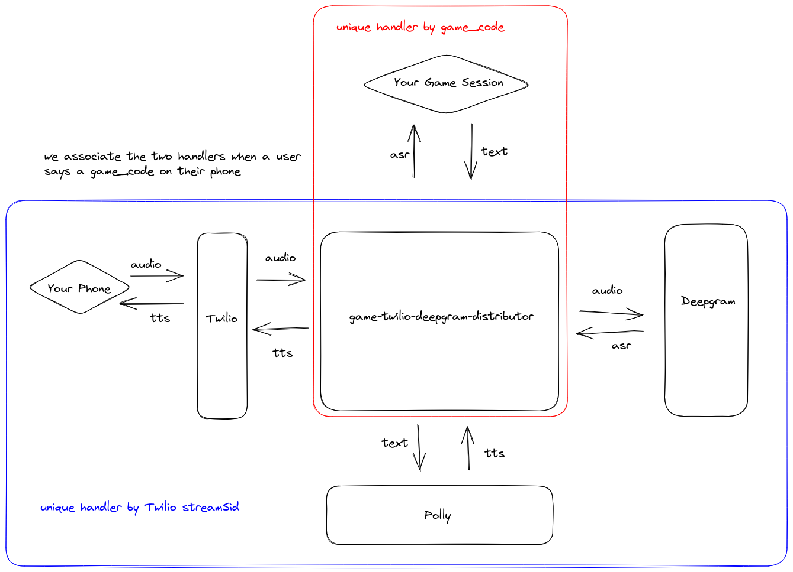

# Calling Your Video Game With Your Phone: Part 2

"Calling Your Video Game With Your Phone" is a 3-part series describing how you can use Twilio, Deepgram, and other technologies to make phone calls which patch into your video game via a websocket server.

In this second part of the series, we will be extending the server we went over in the first part of the series to allow the game client
to "talk" to you on your phone using Text-to-Speech (TTS). This will allow you to begin to implement more interactive experiences with your
phone and your game - for example, having conversations with in-game NPCs in real-time with your phone!

An example game showing off a simple interactive experience written in Godot is shared,
although the client code can still be simple enough to adapt to your needs,
whether you use Unity, or even a non-game front-end application. In fact, just like the version of the server from Part 1, the server we will describe here
is still fully test-able with utilities such as websocat.

The TTS service we will use here in Amazon Polly, although after grasping the general strategy here, one could adapt the server to use any TTS provider.

Here is a diagram of the system we will be building - note the parts which are new since "Part 1":



## Pre-requisites

You will need the following:
* a Deepgram API Key
* a Twilio phone number
* an AWS account with an AWS access key and secret access key with access to Amazon Polly

## Spinning Up the Server

First, clone the repository containing the server code:

```
git clone git@github.com:nikolawhallon/game-twilio-deepgram-distributor.git
```

Next, checkout the `tts` branch - this is the branch containing the code for "Part 2" in the "Calling Your Video Game With Your Phone" series:

```
cd game-twilio-deepgram-distributor
git checkout tts
```

Now, you can spin up the server by simply running `cargo run`. However, you will need the following environment variables set:

* `DEEPGRAM_API_KEY`: a Deepgram API Key to enable transcription
* `TWILIO_PHONE_NUMBER`: your Twilio phone number using the TwiML Bin described in a previous section
* `AWS_REGION`: the AWS region to use for Polly (`us-west-2` should be fine)
* `AWS_ACCESS_KEY_ID`: AWS Key ID for Polly
* `AWS_SECRET_ACCESS_KEY`: AWS Secret Access Key for Polly

This version of the server is very similar to that in "Part 1" - the main difference in functionality is that after a game client
connected to the `/game` endpoint has been associated with an ongoing phone call,
it can now send text messages to the server which the server will then convert into audio
and send to Twilio which will then play that audio over the phone to the caller.

## Setting up Twilio

Spin up the server locally and use `ngrok` to expose it. Then, in your Twilio Console, create a TwiML Bin like the following:

```
<?xml version="1.0" encoding="UTF-8"?>
<Response>
  <Say>This call may be monitored or recordered. Now, say the code you see in the game.</Say>
  <Connect>
    <Stream url="wss://8e8a-97-113-39-114.ngrok.io/twilio" />
  </Connect>
</Response>
```

Attach this TwiML Bin to your Twilio phone number. Check the Twilio documentation for more info.

## Testing With a Client

Testing with websocat is fairly easy. If you spin up the server locally, just connect via:

```
websocat ws://127.0.0.1:5000/game
```

Call the phone number that websocat spits out, and on the phone say the unique code that websocat also spits out.
After that, you should start seeing Deepgram ASR responses stream into your websocat session. In addition, if you
type something into the websocat session and hit "Enter", the server will receive that text, convert it to audio,
and send the audio to Twilio and you should hear your phone saying that text to you!

A simple Godot game has been prepared for you to try this out in a game/game engine. Clone the following repository:

```
git@github.com:nikolawhallon/GodotPhonecall.git
```

And checkout the `tts` branch:

```
cd GodotPhonecall
git checkout tts
```

Then import the game with Godot 3.5, edit the file under `GodotPhonecall/Scenes/Game.gd`, and replace the url on line 16 with your server's url
(if you are running both the game and the server locally, and the server is listening on port 5000, then the url is probably already correct).

**TODO: explain this demo.**

## A Bit of Code

Let's look at some of the code in the `tts` branch of the `game-twilio-deepgram-distributor` server to see how the system described here
is implemented. We won't be going over the full code verbatim, but will explain what each module does and go over some specific parts
which are most relevant - in particular, which parts were changes or added to the version of this server in "Part 1".

### High-Level Overview

The high-level module structure is the same as it was in "Part 1":

* `src/handlers/game.rs` - defines the websocket handler for games connecting to the `/game` endpoint
* `src/handlers/mod.rs` - exposes the `handlers/game` and `handlers/twilio` modules
* `src/handlers/twilio.rs` - defines the websocket handler for Twilio streams connecting to the `/twilio` endpoint
* `src/audio.rs` - defines helper functions for processing audio
* `src/deepgram_response.rs` - defines the structs for Deepgram's API responses
* `src/main.rs` - sets up the initial server state and starts the server
* `src/message.rs` - defines helpers for converting between `axum` websocket messages and `tungstenite` ones
* `src/state.rs` - defines a struct which represents the state of the server
* `src/twilio_response.rs` - defines the structs we'll need for interacting with the Twilio streaming API

### Architecture Changes from Part 1

fdsa

### Text-to-Speech and Twilio Media Messages

wasd

## Conclusion

This guide should help expand on "Part 1", allowing your game to now "talk" back to the caller. This opens
up many interactive possibilities! The example Godot game that was shared showed off a very restrictive
interaction - one even more simple than that of a modern IVR system - however, even in this form, the utility
of the server is apparent.

There are many ways to expand on this idea - one of the logical next steps might
be to integrate the STT and TTS enabled by this server with a chatbot to breathe some life into an NPC or
an in-game personal assistant (imagine a Navi- or Pokédex-esque assistant you can call to ask about in-game
information, like a quick lookup of enemy stats or move sets!). "Part 3" of this series will explore these ideas
more in some more fully-fleshed out, showcase game demos!
