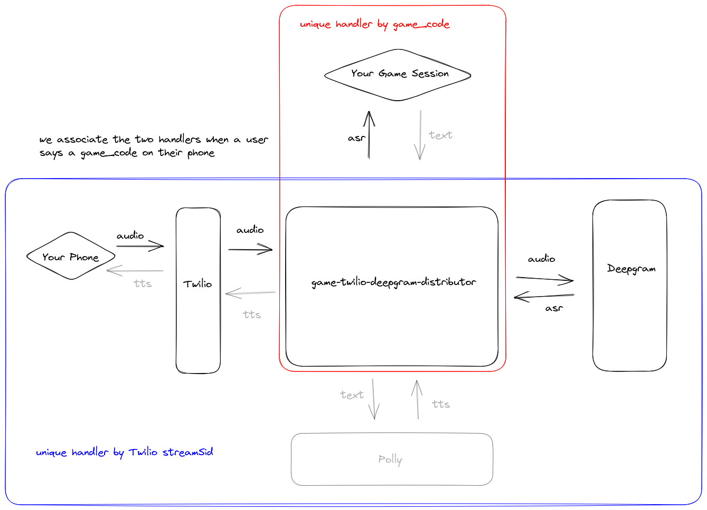

# Calling Your Video Game With Your Phone: Part 1

"Calling Your Video Game With Your Phone" is a 3-part series describing how you can use Twilio, Deepgram, and other technologies
to make phone calls which patch into your video game via a websocket server.

In this first part of the series, we will describe how to use Twilio to stream audio to a server, forward that audio
to Deepgram for transcription, and forward the transcription results to a game instance. An example game written
in Godot is shared, although the client code is simple enough to adapt to your needs, whether you use Unity,
or even a non-game front-end application. In fact, the server we will describe is fully test-able with
utilities such as `websocat`.

The server we will be walking through is written in Rust, but understanding the core architecture of the system
should allow you to build analogous servers in other languages.

Here is a diagram of the system we will be building:



## Pre-requisites

You will need the following:
* a Deepgram API Key
* a Twilio phone number

## Spinning Up the Server

First, clone the repository containing the server code:

```
git clone git@github.com:nikolawhallon/game-twilio-deepgram-distributor.git
```

Next, checkout the `stt` branch - this is the branch containing the code for "Part 1" in the "Calling Your Video Game With Your Phone" series:

```
cd game-twilio-deepgram-distributor
git checkout stt
```

Now, you can spin up the server by simply running `cargo run`. However, you will need the following environment variables set:

* `DEEPGRAM_API_KEY`: a Deepgram API Key to enable transcription
* `TWILIO_PHONE_NUMBER`: your Twilio phone number

When a client connects to the server, the server will send two text websocket messages to the client in a row. The first
will be the Twilio phone number, and the second will be a number between 0 and 100 which represents a unique code for patching
phone calls into client (game) sessions. What do we mean by this? Well, in order for a single Twilio phone number to serve multiple
ongoing client sessions, we need a way to associate a particular phone call with a particle client session. One way to do this is
to have each client session display a code unique to it - if you are playing a game and it displays the code "42," then no other
game session would also be displaying the code "42." Then, if you say this code on the phone, the server can tell that
that phonecall is associated with the game whose code is "42," and the server can start to pass transcription from your phonecall
into that particular game session.

## Setting up Twilio

Spin up the server locally and use `ngrok` to expose it. Then, in your Twilio Console, create a TwiML Bin like the following:

```
<?xml version="1.0" encoding="UTF-8"?>
<Response>
  <Say>This call may be monitored or recordered. Now, say the code you see in the game.</Say>
  <Connect>
    <Stream url="wss://8e8a-97-113-39-114.ngrok.io/twilio" />
  </Connect>
</Response>
```

Attach this TwiML Bin to your Twilio phone number. Check the Twilio documentation for more info.


## Testing With a Client

Testing with websocat is fairly easy. If you spin up the server locally on its default port (5000), just connect via:

```
websocat ws://127.0.0.1:5000/game
```

Call the phone number that websocat displays, and on the phone say the unique code that websocat also displays.
After that, you should start seeing Deepgram ASR responses stream into your websocat session.

A simple Godot game has been prepared for you to try this out in a game/game engine. Clone the following repository:

```
git@github.com:nikolawhallon/GodotPhonecall.git
```

And checkout the `stt` branch:

```
cd GodotPhonecall
git checkout stt
```

Then import the game with Godot 3.5, edit the file under `GodotPhonecall/Scenes/Game.gd`, and replace the url on line 16 with your server's url
(if you are running both the game and the server locally, and the server is listening on port 5000, then the url is probably already correct).

## A Bit of Code

Let's look at some of the code in the `stt` branch of the `game-twilio-deepgram-distributor` server to see how the system described here
is implemented. We won't be going over the full code verbatim, but will explain what each module does and go over some specific parts
which are most relevant. The server is written in Rust and uses the `axum` web server library to handle incoming websocket connections,
and the `tungstenite` library for handling outgoing websocket connections. The server is written asynchronously using the `tokio` runtime.

### High-Level Overview

If you haven't already from going over a previous section, checkout the repository and the `stt` branch:

```
git clone git@github.com:nikolawhallon/game-twilio-deepgram-distributor.git
cd game-twilio-deepgram-distributor
git checkout stt
```

I'll start by explaining at a high-level the module structure:

* `src/handlers/game.rs` - defines the websocket handler for games connecting to the `/game` endpoint
* `src/handlers/mod.rs` - exposes the `handlers/game` and `handlers/twilio` modules
* `src/handlers/twilio.rs` - defines the websocket handler for Twilio streams connecting to the `/twilio` endpoint
* `src/audio.rs` - defines helper functions for processing audio
* `src/deepgram_response.rs` - defines the structs for Deepgram's API responses
* `src/main.rs` - sets up the initial server state and starts the server
* `src/message.rs` - defines helpers for converting between `axum` websocket messages and `tungstenite` ones
* `src/state.rs` - defines a struct which represents the state of the server
* `src/twilio_response.rs` - defines the structs we'll need for interacting with the Twilio streaming API

### The Server State

Let's start by taking a look at the server state. In `state.rs` the following struct is defined:

```
pub struct State {
    pub deepgram_url: String,
    pub api_key: String,
    pub twilio_phone_number: String,
    pub games: Mutex<HashMap<String, SplitSink<WebSocket, Message>>>,
    pub game_codes: Mutex<HashSet<String>>,
}
```

The server needs to know the Deepgram URL (`deepgram_url`), including any query parameters we want to send to
Deepgram when opening up our streaming websocket connections for transcription. It also needs a Deepgram API key
(`api_key`) to authenticate with Deepgram when connecting.
Next is `twilio_phone_number` - the server is meant to handle calls to a single Twilio phone number, and that's what
this field holds.

Next let's look at `game_codes` - it is a `Mutex` of a `HashSet` of `String`s. Since our game codes
are going to be integers, this inner type could have been a `usize` or something similar, but since Deepgram returns
numbers in a transcript as `String`s, keeping this inner type a `String` will work fine (and would allow us to change
the game codes to any arbitrary words as well). When a new game client connects to the server, we will remove a game
code from the set of game codes, and use it as the key to map to the game client's websocket connection's sending half.
Once the game client's websocket connection is closed, we will return its game code back to the `game_codes`' `HashSet`.

This brings us to the `games` field - it is a `Mutex` of a `HashMap` mapping a `String` (a game code) to a
`SplitSink<WebSocket, Message>`, which is the sending half of a game client's websocket connection. The `games` and `game_codes`
fields need to be wrapped in `Mutex`s because they need to be accessed by both the Twilio and the game websocket handlers,
which run asynchronously and independently.

### The Game Websocket Handler

Now let's turn our attention to the handler for websocket connections to the `/game` endpoint. This is mostly handled
in the `handle_socket` function in the `src/handlers/game.rs` module. This function is reproduced below:

```
async fn handle_socket(socket: WebSocket, state: Arc<State>) {
    let (mut game_sender, mut game_reader) = socket.split();

    let game_code = pop_a_game_code(state.clone()).await;

    match game_code {
        Some(game_code) => {
            // we add this manual scoping so that we drop the games lock after this logic
            {
                let mut games = state.games.lock().await;

                // tell the game the phone number to call
                game_sender
                    .send(Message::Text(state.twilio_phone_number.clone()).into())
                    .await
                    .expect("Failed to send the phone number to the game.");

                // tell the game what game code we are assigning it
                game_sender
                    .send(Message::Text(game_code.clone()).into())
                    .await
                    .expect("Failed to send the game code to the game.");

                // insert a game ws (sender) handle for this game code, so that our Twilio handler can reference it
                games.insert(game_code.clone(), game_sender);
            }

            while let Some(Ok(msg)) = game_reader.next().await {
                if let Message::Close(_) = Message::from(msg) {
                    let mut games = state.games.lock().await;
                    games.remove(&game_code);
                    let mut game_codes = state.game_codes.lock().await;
                    game_codes.insert(game_code.clone());
                }
            }

            let mut games = state.games.lock().await;
            games.remove(&game_code);
            let mut game_codes = state.game_codes.lock().await;
            game_codes.insert(game_code);
        }
        None => {
            return;
        }
    }
}
```

When a game client connects to `/game`, the first thing our server does is try to obtain a unique game code for the session
from the server state's `game_codes` field - this is done via
the helper function, `pop_a_game_code`. If we weren't able to obtain a game code (because all game codes are being used),
we immediately return, which will close the websocket connection. This limits the number of active game sessions possible,
so if the game codes set contains, say, 100 entries, then only 100 game sessions can be active at one time. However, the logic
for populating or expanding the game codes set can be altered in a number of ways to allow for a virtually unlimited
number of game codes.

If we did obtain a game code, we immediately send two, websocket text messages back to the game client, the first containing
the Twilio phone number that this server serves, and the second containing the game code we have assigned to this session.
Then we insert the sending half of this game-server websocket connection into the server state's `games` object - this is
what will allow the Twilio websocket handler the ability to send messages to a connected game session.

Finally, we have some code which will restore the `games` and `game_codes` fields of the server state when this game client's
websocket connection closes - returning the assigned game code to the game codes set.

### The Twilio Websocket Handler

The main logic for handling incoming phonecalls to the server's Twilio number is in the `src/handlers/twilio.rs` module.
Specifically the `handle_socket`, `handle_from_twilio`, and `handle_to_game` functions. Take a look at the module
to follow along - I will describe what these functions are doing here.

The function `handle_socket` splits the incoming websocket handler from Twilio into sending and receiving halfs,
opens a websocket connection to Deepgram, using the Deepgram API key stored in the server state,
splits the Deepgram websocket handler into sending and receiving halfs, and then spawns two asynchronous tasks:

```
    tokio::spawn(handle_to_game(Arc::clone(&state), deepgram_reader));
    tokio::spawn(handle_from_twilio(this_receiver, deepgram_sender));
```

Here, `handle_from_twilio` takes the Twilio websocket receiver and the Deepgram websocket sender. This function receives
messages from Twilio, parses the messages to extract the audio from the incoming phonecall, and passes that audio along to Deepgram
for transcription. Then, `handle_to_game` will receive the transcription results from Deepgram because it takes the Deepgram
websocket reader as an argument. Its other argument, the server state, allows it to access the `games` fields on the server
state. `handle_to_game` will inspect Deepgram transcripts to see if the caller has said one of the keys to the `games` `HashMap`.
If it has, our server can now patch this phonecall to the game with the spoken game code, and start sending all Deepgram messages
through to that game client.

### Tying it Together with Main

`src/main.rs` spins up the axum webserver handling requests to two endpoints - `/game` and `/twilio`. The handlers
for these endpoints were explained in a previous section. Besides extracting the necessary values for `TWILIO_PHONE_NUMBER`
and `DEEPGRAM_API_KEY`, as described in a previous section, `main.rs` does two other note-worthy things.

The first is it defines the URL to use to connect to Deepgram, with a default value of:

```
wss://api.deepgram.com/v1/listen?encoding=mulaw&sample_rate=8000&numerals=true
```

Of note here is that we set the encoding to `mulaw` and the sample rate to `8000` - this is the format of the raw audio
that Twilio will send to the server. Also, we set `numerals=true` because we want our game codes in this demos to simply be numbers.

Second is it creates the initial state of the server, and notably defines the set of game codes via the following:

```
    let mut game_codes = HashSet::new();

    for number in 0..100 {
        game_codes.insert(number.to_string());
    }

    let state = Arc::new(state::State {
        deepgram_url,
        api_key,
        twilio_phone_number,
        games: Mutex::new(HashMap::new()),
        game_codes: Mutex::new(game_codes),
    });
```

Here we are simply setting the game codes to all numbers `0`, `1`, `2`, ..., `99`. When adapting this demo for a real game application,
this logic which sets up the game codes ought likely to be modified. In one of my games, I create a configuration file where I can list
out all game codes I want the server to use. One can imagine other ways to populate, or to auto-generate on the fly, game codes.

## Conclusion

This guide should help get you up and running with streaming transcription into your game via a phonecall.
At this point, there are already several cool applications that can be built, like a game where you need
to perform some voice control operations, but for which your gaming device does not have a microphone
(plus, having to use your phone, while potentially cumbersome, is really fun, bizarre, and meta).

However, in the next parts of this tutorial series, we will expand on this server to allow for
interactions - imagine calling a character in a game with your phone and having an actual conversation
which impacts what is going on in the game world. Imagine if the phonecalls from Pokémon Silver/Gold/Crystal
where trainers are challenging you to a rematch used your real physical phone, or a dating sim where
you can continue carrying out a conversation via phone even after you have logged off of the game,
or a game where you can call a number to order a pizza which your character then receives in-game
for additional health or a stat boost. The possibilities are weird, but limitless!
