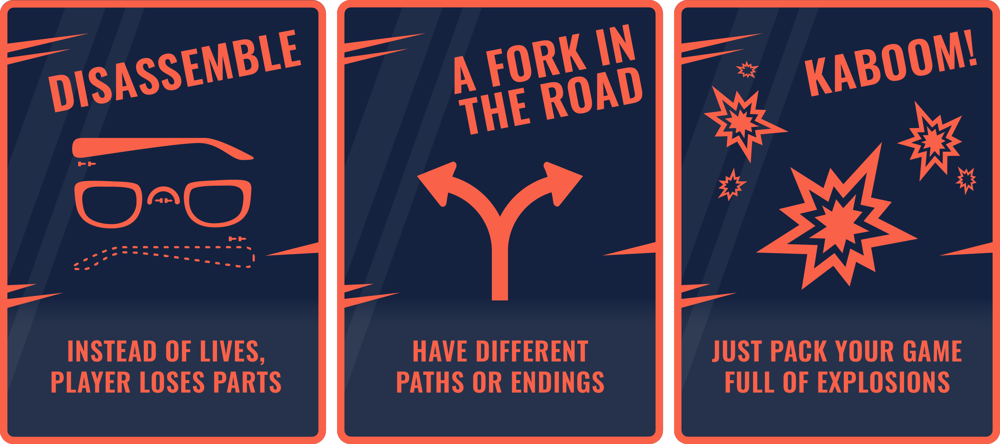
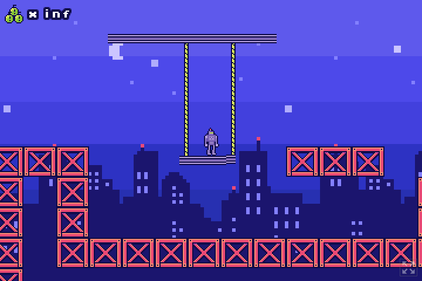
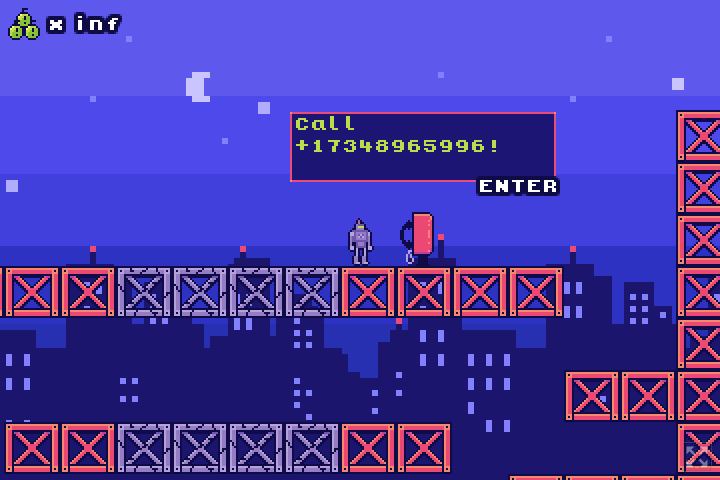

# Calling Your Video Game With Your Phone: Part 3

In this final part in the 3-part series, we will look at a simple game
made for a game jam which uses a slightly modified version of the server
from "Part 2" to offer a unique gameplay twist! That game is
[Robot Dreams](https://browncanstudios.itch.io/robot-dreams),
made for [the Godot Wildjam #55](https://itch.io/jam/godot-wild-jam-55).

The code for the backend server can be found on the `robot-dreams` branch
of the `game-twilio-deepgram-distributor` repository [here](https://github.com/deepgram-devs/game-twilio-deepgram-distributor/tree/robot-dreams),
and the Godot game which is a client to this server can be found [here](https://github.com/nikolawhallon/RobotDreams).


## The Game Jam at a High Level

The duration of the game jam was a little over a week, and games made
for it had to attempt to match the following theme
and optional "wild-cards":




There were 93 entries to the game jam, which were collectively rated 1423 times in the week after
submissions closed. The ratings for Robot Dreams can be seen [here](https://itch.io/jam/godot-wild-jam-55/rate/1964316).
Overall, games were rated by a passionate, enthustiastic, and supportive community, and I
encourage anyone to participate in these sorts of events, and feel free to add interesting new tech
to your game jam games!

## Robot Dreams

Our entry, "Robot Dreams", aimed to match the theme of "Dreams" as well as the wildcard "A Fork in the Road"
by use of the call-your-game system described in this series. You begin the game
as a human falling asleep in your bed, only to wake up as a robot in a construction site
against the backdrop of a cityscape. In order to wake up, you, the player, must find a way to
get the robot to jump from a great height. Each time you do, you wake up in another level - another dream.
After 3 levels, you wake up - but as a robot - implying you are in an infinite cycle of dreams!



The only way to truly wake up - as a human - is to find a payphone in Level 2, which instructs you to
call a phone number and tell the AI on the other end a secret password - if you do this with your
IRL phone, you skip ahead to the "good" ending.



A bit of a mini, meta game, the actual phonecall has very little interaction involved, but even still
it adds a very cool sense of delight when your real-world action causes immediate in-game consequences!

## Some Technical Details

The technical changes with respect to the server presented in "Part 2" of this series are very
minor and can be reviewed [here](https://github.com/deepgram-devs/game-twilio-deepgram-distributor/pull/4).
The main change is the ability to specify a config file via the command line using `--config=some_json_file`.
This config file will enumerate all game codes that can be used to patch phone calls into game session.
The config file used for the deployed version of Robot Dreams is abbreviated below:

```
{
    "game_codes":["apple", "banana", "kiwi", ..., "oregano"]
}
```

there is a pretty small, finite number of game codes in the list, but with no expectation of large numbers
of simultaneous game players, this isn't an issue. One can imagine modifying the server further to
interact with a database of game codes, with `POST`, `GET`, `DELETE`, etc endpoints if one's project were
to scale - surely there are many other mechanisms to populate allowed game codes.

The server was run on an AWS instance using `docker` and `docker-compose` - after building
the `docker` image `browncanstudios/robot-dreams-server:0.1.0`, it was spun up with the following `docker-compose`
file (sensitive information redacted of course):

```
version: '3.7'
services:
  web:
    image: browncanstudios/robot-dreams-server:0.1.0
    ports:
      - "5000:5000"
    volumes:
      - /home/ubuntu/config.json:/config.json:ro
    environment:
      - PROXY_URL=0.0.0.0:5000
      - DEEPGRAM_URL=wss://api.deepgram.com/v1/listen?encoding=mulaw&sample_rate=8000&numerals=true&tier=enhanced&interim_results=true
      - AWS_REGION=***
      - AWS_ACCESS_KEY_ID=***
      - AWS_SECRET_ACCESS_KEY=***
      - TWILIO_PHONE_NUMBER=***
      - DEEPGRAM_API_KEY=***
    command: --config=config.json
```

## Conclusion

This was just a quick game made in a little over a week, and has many short-comings. For one, there is no feedback on the phone
when the AI is unable to make out a game code you may be saying, and indeed the AI is only listening for English and isn't optimized
for many English accents. Deepgram, and other vendors, provide models in many languages and accents, and even offer automatic language
detection (although usually not for real-time streaming applications), so improving in this area would be huge for
accessibility. Speaking of accessibility though, requiring a phone call to achieve the "good ending" itself can be a blocker,
and I would recommend that any serious game looking to get published should offer these types of features as options, and not
as requirements to enjoy the main aspects of the game. That said, voice technology, and even interfacing with your phone
can be seen as expanding accessibility if done correctly.

Besides these thoughts, I don't have a dramatic take away from this series other than "hey this is pretty cool!" and maybe
that's just fine - games are sometimes meant to just "be neat."

## Further Reading

* [Calling Your Video Game With Your Phone: Part 1](https://github.com/deepgram-devs/game-twilio-deepgram-distributor/tree/stt)
* [Calling Your Video Game With Your Phone: Part 2](https://github.com/deepgram-devs/game-twilio-deepgram-distributor/tree/tts)
* [Deepgram-Twilio streaming in Python](https://blog.deepgram.com/deepgram-twilio-streaming/)
* [Deepgram-Twilio streaming in Rust](https://blog.deepgram.com/deepgram-twilio-streaming-rust/)
* [Deepgram streaming in Godot](https://blog.deepgram.com/deepgram-godot-tutorial/)
