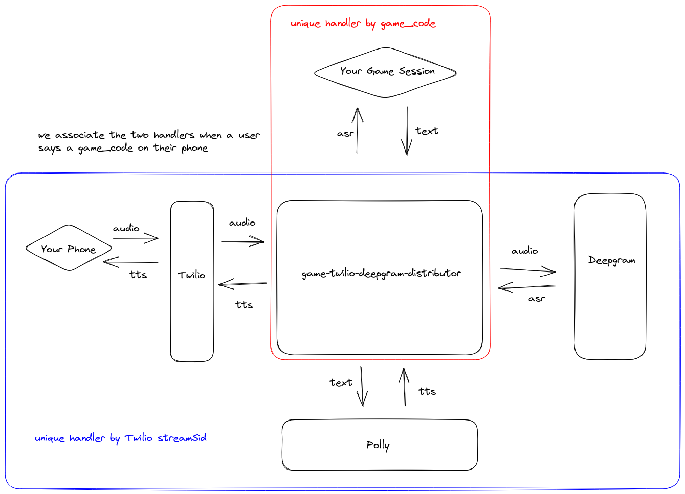

# Calling Your Video Game With Your Phone: Part 2

"Calling Your Video Game With Your Phone" is a 3-part series describing how you can use Twilio, Deepgram, and other technologies to make phone calls which patch into your video game via a websocket server.

In this second part of the series, we will be extending the server we went over in the first part of the series to allow the game client
to "talk" to you on your phone using Text-to-Speech (TTS). This will allow you to begin to implement more interactive experiences with your
phone and your game - for example, having conversations with in-game NPCs in real-time with your phone!

An example game showing off a simple interactive experience written in Godot is shared,
although the client code can still be simple enough to adapt to your needs,
whether you use Unity, or even a non-game front-end application. In fact, just like the version of the server from Part 1, the server we will describe here
is still fully test-able with utilities such as websocat.

The TTS service we will use here in Amazon Polly, although after grasping the general strategy here, one could adapt the server to use any TTS provider.

Here is a diagram of the system we will be building - note the parts which are new since "Part 1":



## Pre-requisites

You will need the following:
* a Deepgram API Key
* a Twilio phone number
* an AWS account with an AWS access key and secret access key with access to Amazon Polly

## Spinning Up the Server

First, clone the repository containing the server code:

```
git clone git@github.com:nikolawhallon/game-twilio-deepgram-distributor.git
```

Next, checkout the `tts` branch - this is the branch containing the code for "Part 2" in the "Calling Your Video Game With Your Phone" series:

```
cd game-twilio-deepgram-distributor
git checkout tts
```

Now, you can spin up the server by simply running `cargo run`. However, you will need the following environment variables set:

* `DEEPGRAM_API_KEY`: a Deepgram API Key to enable transcription
* `TWILIO_PHONE_NUMBER`: your Twilio phone number using the TwiML Bin described in a previous section
* `AWS_REGION`: the AWS region to use for Polly (`us-west-2` should be fine)
* `AWS_ACCESS_KEY_ID`: AWS Key ID for Polly
* `AWS_SECRET_ACCESS_KEY`: AWS Secret Access Key for Polly

This version of the server is very similar to that in "Part 1" - the main difference in functionality is that after a game client
connected to the `/game` endpoint has been associated with an ongoing phone call,
it can now send text messages to the server which the server will then convert into audio
and send to Twilio which will then play that audio over the phone to the caller.

## Setting up Twilio

Spin up the server locally and use `ngrok` to expose it. Then, in your Twilio Console, create a TwiML Bin like the following:

```
<?xml version="1.0" encoding="UTF-8"?>
<Response>
  <Say>This call may be monitored or recordered. Now, say the code you see in the game.</Say>
  <Connect>
    <Stream url="wss://8e8a-97-113-39-114.ngrok.io/twilio" />
  </Connect>
</Response>
```

Attach this TwiML Bin to your Twilio phone number. Check the Twilio documentation for more info.

## Testing With a Client

Testing with websocat is fairly easy. If you spin up the server locally, just connect via:

```
websocat ws://127.0.0.1:5000/game
```

Call the phone number that websocat spits out, and on the phone say the unique code that websocat also spits out.
After that, you should start seeing Deepgram ASR responses stream into your websocat session. In addition, if you
type something into the websocat session and hit "Enter", the server will receive that text, convert it to audio,
and send the audio to Twilio and you should hear your phone saying that text to you!

A simple Godot game has been prepared for you to try this out in a game/game engine. Clone the following repository:

```
git@github.com:nikolawhallon/GodotPhonecall.git
```

And checkout the `tts` branch:

```
cd GodotPhonecall
git checkout tts
```

Then import the game with Godot 3.5, edit the file under `GodotPhonecall/Scenes/Game.gd`, and replace the url on line 16 with your server's url
(if you are running both the game and the server locally, and the server is listening on port 5000, then the url is probably already correct).

When you call the phone number and say the game code presented to you by the game, the game will ask you if you would like to order a mushroom,
pepperoni, or cheese pizza. If you respond with one of these three options, the game will display which option you picked! Exciting, right?
Well one can extrapolate to some pretty cool ideas.

## A Bit of Code

Let's look at some of the code in the `tts` branch of the `game-twilio-deepgram-distributor` server to see how the system described here
is implemented. We won't be going over the full code verbatim, but will explain what each module does and go over some specific parts
which are most relevant - in particular, which parts were changes or added to the version of this server in "Part 1".

### High-Level Overview

The high-level module structure is the same as it was in "Part 1":

* `src/handlers/game.rs` - defines the websocket handler for games connecting to the `/game` endpoint
* `src/handlers/mod.rs` - exposes the `handlers/game` and `handlers/twilio` modules
* `src/handlers/twilio.rs` - defines the websocket handler for Twilio streams connecting to the `/twilio` endpoint
* `src/audio.rs` - defines helper functions for processing audio
* `src/deepgram_response.rs` - defines the structs for Deepgram's API responses
* `src/main.rs` - sets up the initial server state and starts the server
* `src/message.rs` - defines helpers for converting between `axum` websocket messages and `tungstenite` ones
* `src/state.rs` - defines a struct which represents the state of the server
* `src/twilio_response.rs` - defines the structs we'll need for interacting with the Twilio streaming API

### Architecture Changes from Part 1

In the server presented in "Part 1," once the caller said a game code,
the Twilio websocket handler was able to get a handle to the sender half of
the websocket connection to the game session, and with it send Deepgram ASR messages to a game session.
The game session never needed to send a message back to our server, so this sufficed. However, now
we intend to give the ability to the game session to send text messages back to our server to then use
TTS to turn into audio to then send back to the caller's phone via the Twilio websocket handler.

This added bit of complexity encourages a slightly new design. Let's look at the new `src/state.rs`
for more details:

```
use crate::message::Message;
use futures::lock::Mutex;
use std::collections::{HashMap, HashSet};

pub struct State {
    pub deepgram_url: String,
    pub api_key: String,
    pub twilio_phone_number: String,
    pub games: Mutex<HashMap<String, GameTwilioTxs>>,
    pub game_codes: Mutex<HashSet<String>>,
}

pub struct GameTwilioTxs {
    pub game_tx: async_channel::Sender<Message>,
    pub twilio_tx: Option<async_channel::Sender<Message>>,
}
```

The `games` field used to be of type `Mutex<HashMap<String, SplitSink<WebSocket, Message>>>`, but now
contains the `Sender` half of two `async_channel` channels instead.

This is going to allow the Twilio websocket handler to send Deepgram ASR messages to a `game_tx`, and when the `game_rx` receives these messages
in the game client websocket handler code, it can forward them on to the game client.

Likewise, the game client websocket handler will be able to receive text websocket messages from the game client,
forward those to the Twilio websocket handler code via a `twilio_tx`, and when the `twilio_rx` receives
these messages, the Twilio websocket hanlder will be able to make TTS requests, and forward that audio
to the ongoing phone call.

This is the main architecture change from the server from "Part 1," and hopefully the doc-comments present in the code
can help clarify more!

### Text-to-Speech and Twilio Media Messages

This server is using Amazon Polly for TTS - specifically, the new [developer previous release of the Amazon Polly Rust SDK](https://docs.aws.amazon.com/sdk-for-rust/latest/dg/rust_polly_code_examples.html).
In order to forward audio from the TTS to your phone, we will use the [Twilio streaming media API](https://www.twilio.com/docs/voice/twiml/stream#message-media-to-twilio),
which will require us to obtain the `streamSid` of the Twilio stream (a unique identifier for the stream, provided by Twilio), and to convert the TTS audio to `mulaw`. Let's take a look at the main
handler for this logic and explain its parts:

```
/// when the game handler sends a message here via the twilio_tx,
/// obtain TTS audio for the message and forward it to twilio via
/// the twilio sender ws handle
async fn handle_from_twilio_tx(
    twilio_rx: async_channel::Receiver<Message>,
    mut twilio_sender: SplitSink<WebSocket, axum::extract::ws::Message>,
    streamsid_rx: oneshot::Receiver<String>,
) {
    let streamsid = streamsid_rx
        .await
        .expect("Failed to receive streamsid from handle_from_twilio_ws.");

    while let Ok(message) = twilio_rx.recv().await {
        if let Message::Text(message) = message {
            let shared_config = aws_config::from_env().load().await;
            let client = Client::new(&shared_config);

            if let Ok(polly_response) = client
                .synthesize_speech()
                .output_format(OutputFormat::Pcm)
                .sample_rate("8000")
                .text(message)
                .voice_id(VoiceId::Joanna)
                .send()
                .await
            {
                if let Ok(pcm) = polly_response
                    .audio_stream
                    .collect()
                    .await
                    .and_then(|aggregated_bytes| Ok(aggregated_bytes.to_vec()))
                {
                    let mut i16_samples = Vec::new();
                    for i in 0..(pcm.len() / 2) {
                        let mut i16_sample = pcm[i * 2] as i16;
                        i16_sample |= ((pcm[i * 2 + 1]) as i16) << 8;
                        i16_samples.push(i16_sample);
                    }

                    let mut mulaw_samples = Vec::new();
                    for sample in i16_samples {
                        mulaw_samples.push(audio::linear_to_ulaw(sample));
                    }

                    // base64 encode the mulaw, wrap it in a Twilio media message, and send it to Twilio
                    let base64_encoded_mulaw = general_purpose::STANDARD.encode(&mulaw_samples);

                    let sending_media =
                        twilio_response::SendingMedia::new(streamsid.clone(), base64_encoded_mulaw);

                    let _ = twilio_sender
                        .send(Message::Text(serde_json::to_string(&sending_media).unwrap()).into())
                        .await;
                }
            }
        }
    }
}
```

This handler takes the `twilio_rx` explained in the previous section,
the sending half of the Twilio websocket connection (`twilio_sender`), and
the receiving end of a one-shot channel (`streamsid_rx`) as input.

The `streamSid` is sent by Twilio to our server, so the function which handles the
receiving half of the Twilio websocket connection will obtain this value and send it here
via the one-shot channel.

Then, we will loop over text messages received by `twilio_rx` (ultimately being text messages
send to our server from a game client), create a Polly client, make a Polly request to obtain
the TTS audio of the text, using 8000 Hz, one channel PCM, convert this into 8000 Hz, one channel
`mulaw` via the new `linear_to_ulaw` function defined in `src/audio.rs`, `base64` encode the `mulaw`
audio, and send it back to Twilio as a serialized `SendingMedia` object. The definition for this type
has been added to `src/twilio_response.rs`:

```
#[derive(Serialize, Deserialize, Default, Debug)]
pub struct Media {
    pub payload: String,
}

#[derive(Serialize, Deserialize, Default, Debug)]
#[serde(rename_all = "camelCase")]
pub struct SendingMedia {
    event: String,
    stream_sid: String,
    media: Media,
}

impl SendingMedia {
    pub fn new(stream_sid: String, payload: String) -> Self {
        SendingMedia {
            event: "media".to_string(),
            stream_sid,
            media: Media { payload },
        }
    }
}
```

and notably requires the `streamSid` so that Twilio knows where to send the audio.

This is the bulk of the new logic in this server, as compared to the server in "Part 1," and hopefully the design
and strategy here is clear enough to apply to suit your stack and your needs!

## Conclusion

This guide should help expand on "Part 1", allowing your game to now "talk" back to the caller. This opens
up many interactive possibilities! The example Godot game that was shared showed off a very restrictive
interaction - one even more simple than that of a modern IVR system - however, even in this form, the utility
of the server is apparent.

There are many ways to expand on this idea - one of the logical next steps might
be to integrate the STT and TTS enabled by this server with a chatbot to breathe some life into an NPC or
an in-game personal assistant (imagine a Navi- or Pokédex-esque assistant you can call to ask about in-game
information, like a quick lookup of enemy stats or move sets!). "Part 3" of this series will explore these ideas
more in some more fully-fleshed out, showcase game demos!
